# 设计模式（OOAD）

*注：答案仅为作者个人思路，不保证正确率，答案见代码。*

### 一、策略模式（strategy）

- homework1

  In an action adventure game, each character can make use of one weapon at a time, but can change weapons at any time during the game. Your job is to program according to the following class diagram.（一个动作冒险游戏，每个角色一次只能使用一种武器，但是可以在游戏的过程中换武器。下面是类图，请根据类图编写代码。）

  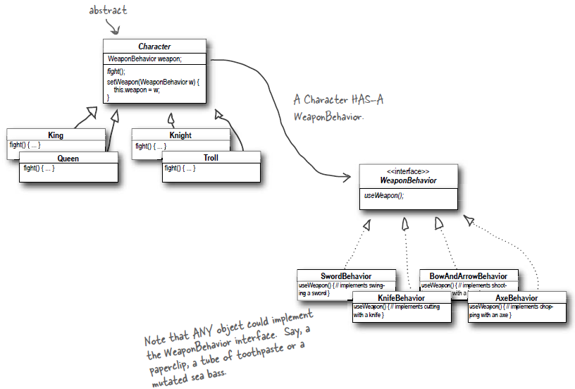

- homework2

  In a university simulation system, a graduate can have three roles, and can change roles during the runtime, but can have only one role at a time. Your job is to draw the class diagram according to the following code in Java.（一个研究生在校期间，可以具有三种角色：学生、助教、收银员，但同一时刻只能具有一种角色。实现这个系统的代码如下，请根据代码画出类图。）
  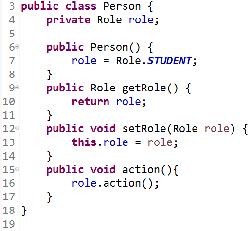

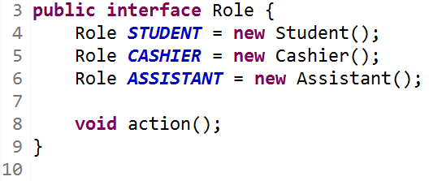

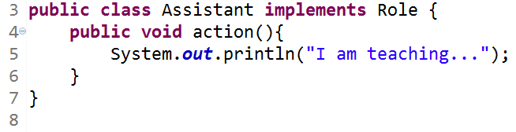

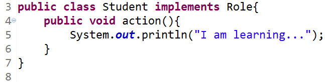

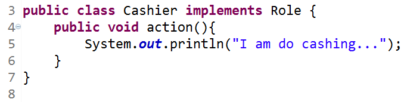

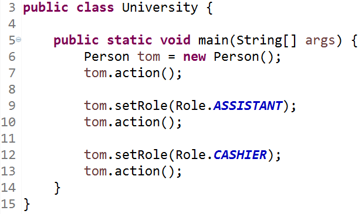

- homework3

  In a an online bookstore system, there are a 10% discount on every computer book, a ￥2 discount on every language book, and a ￥10 discount for every ￥100 on all the novel books .（设计一个网上书店，该系统中所有计算机类图书(ComputerBook)每本都有10%的折扣，所有语言类图书(LanguageBook)每本都有2元的折扣，小说类图书(NovelBook)每100元有10元的折扣。请使用策略模式来实现系统，绘制类图并编程实现。

- report
  To apply the Strategy Pattern into the design the Flight Simulation System.

### 二、观察者模式（observe）

- 相关知识

  1、相关知识：
  （1）观察者的使用场景

  The Observer Pattern defines a one-to-many dependency between objects so that when one object changes state, all of its dependents are notified and updated automatically.
  （2）观察者的通用类图

  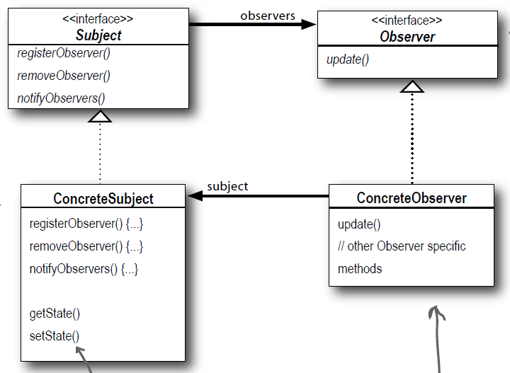

- homework1

  In a multiplayer game, many players can join the same team. As one member of the team was attacked by the enemy, all the other members will received the notice and take the action. Your job is to program according to the following class diagram.（一款多人联机对战游戏,在该游戏中,多个玩家可以加入同一战队组成联盟,当战队中某一个成员受到敌人的攻击时将给所有其他盟友发送通知,盟友收到通知后将做出响应。下面是类图，请根据类图编写代码。）

  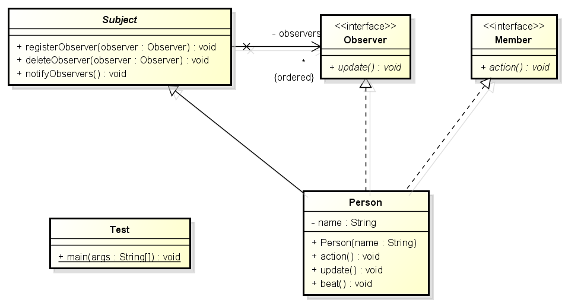

- homework2

  Designing an online stock software which has the following functions: 1. Supports two securities trading markets in Shanghai and Shenzhen;2. Support common and VIP stock customers;3. When the price of shares traded on the Shanghai stock exchange fluctuate 3%, the ordinary customer will be notified, and the VIP customers will be notified when the price changes 1%.When the price of the shares traded on the Shenzhen stock exchange is 5%, the ordinary customer will be notified, and the VIP customers will be notified when the price changes 1%. Your job is to draw the class diagram according to the following code in Java.（设计一款在线股票软件,该软件具有如下功能:1.支持上海及深圳两个证券交易市场;2.支持普通和VIP两类股票客户;3.上证交易所上交易的股票价格变动3%时,通知普通客户,价格变动1%时,通知VIP客户; 深证交易所上交易的股票价格变动5%时,通知普通客户,价格变动2%时,通知VIP客户。实现这个系统的代码如下，请根据代码画出类图。）

  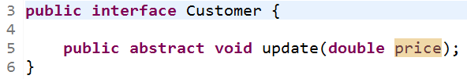

  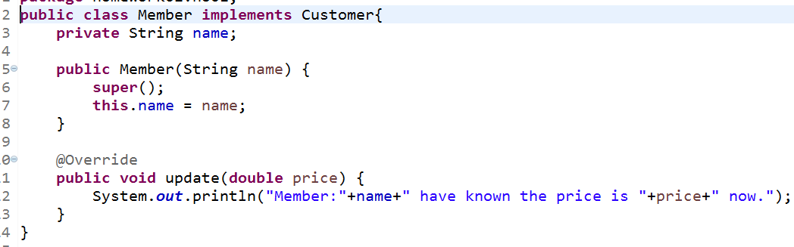

  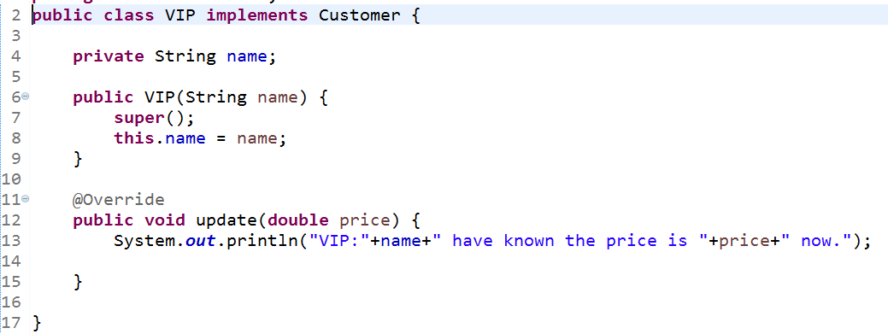

  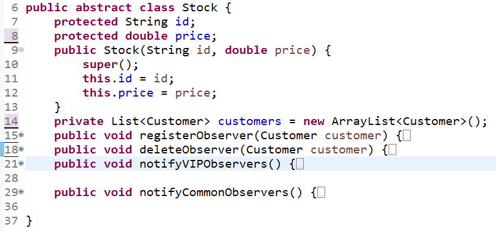

  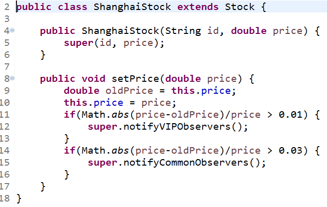

  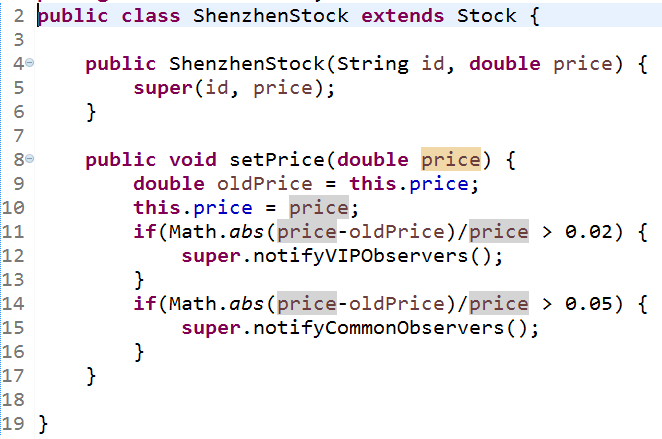

  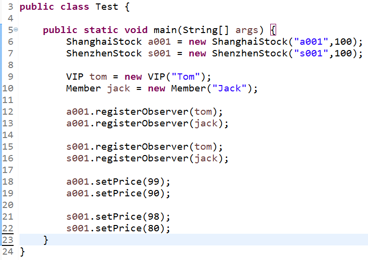

- homework3

  系统名称：国家宝藏游戏系统（National treasure game system）                                                          

  人物角色：凯奇（Cage）                                                         

  两个守护神(Eudemon)：老虎（Tiger）、狮子（Lion）                                 

  两种宝藏（Treasure）：黄金（Gold）、钻石（Diamond）                                

  游戏场景（Scene）：场景中包括1个角色，5只老虎，7只狮子，500箱黄金，100箱钻石                                        

  功能需求：                                                                      

    1、凯奇可以拿走一定数量的宝藏take（int quantity）；                           

    2、宝藏可以安排数位守护神看守宝藏guard（Eudemon eudemon）和解除关系的unguard（Eudemon eudemon）方法。                                                     

    3、每当凯奇拿走宝藏时，都会惊动所有看守该宝藏的守护神notifyEudemon（）             

    4、守护神在得到通知update（:Treasure,:int）后，都会报告宝藏剩余的数量，并发出攻击attack（）                                                                

    5、场景中的情节是凯奇拿走了132#箱中的50克黄金，以及3#箱中的100克拉钻石。  

  任务要求：请根据以上背景描述， 设计类图，编写代码并测试验证。    

- report

  An online stock system: When a stock price fluctuates more than 5%, the system automatically notified to all the shareholders. 

  Your job is to…

  (1) Design the class diagram

  (2) program according to your class diagram

  (3) Test your design with the old price is 100, the new price is 98 and 92. 

### 三、装饰者模式

- 相关知识

  （1）装饰者的使用场景

  The Decorator Pattern attaches additional responsibilities to an object dynamically. Decorators provide a flexible alternative to subclassing for extending functionality.

  （2）装饰者的通用类图

  

- homework1
  Following given example is an class diagram of decorator design pattern. Icecream is a classic example for decorator design pattern. You create a basic icecream and then add toppings to it as you prefer. The added toppings change the taste of the basic icecream.(下面是类图，请根据类图编写代码)。 

  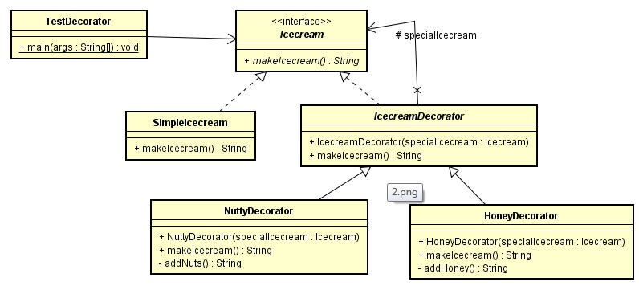

- homework2

  We're going to create a Shape interface and concrete classes implementing the Shape interface. We will then create an abstract decorator class ShapeDecorator implementing the Shape interface and having Shape object as its instance variable.

  RedShapeDecorator is concrete class implementing ShapeDecorator.

  TestShape, our demo class will use RedShapeDecorator to decorate Shape objects..
  Codes:

  ~~~java
  public class testShape {
  
  	public static void main(String[] args) {
  
  	      Shape circle = new Circle();
  
  	      Shape redCircle = new RedShapeDecorator(new Circle());
  
  	      Shape redRectangle = new RedShapeDecorator(new Rectangle());
  	      System.out.println("Circle with normal border");
  	      circle.draw();
  
  	      System.out.println("\nCircle of red border");
  	      redCircle.draw();
  
  	      System.out.println("\nRectangle of red border");
  	      redRectangle.draw();
  	   }
  
  }
  
  interface Shape {  
  void draw();  
  }
  
  class Rectangle implements Shape {
  	   @Override
  	   public void draw() {
  	      System.out.println("Shape: Rectangle");
  	   }
  }
  class Circle implements Shape {
  
  	   @Override
  	   public void draw() {
  	      System.out.println("Shape: Circle");
  	   }
  }
  
  abstract class ShapeDecorator implements Shape {   
  	   
         protected Shape decoratedShape;
  
  	   public ShapeDecorator(Shape decoratedShape){
  	      this.decoratedShape = decoratedShape;
  	   }
  
  	   public void draw(){
  	      decoratedShape.draw();
  	   }	
  }
  
  class RedShapeDecorator extends ShapeDecorator {
  
  	   public RedShapeDecorator(Shape decoratedShape) {
  	      super(decoratedShape);		
  	   }
  
  	   @Override
  	   public void draw() {
  	      decoratedShape.draw();	       
  	      setRedBorder(decoratedShape);
  	   }
  
  	   private void setRedBorder(Shape decoratedShape){
  	      System.out.println("Border Color: Red");
  	   }
  }
  
  ~~~

- homework3

  To decorate a simple room with color and curtains, try to provide a solution which contains class diagrams and codes based on your class diagram.(完成类图，请根据类图编写代码）。

- report

  Consider a window in a windowing system. To allow scrolling of the window's contents, one may wish to add horizontal or vertical scrollbars to it, as appropriate. Assume windows are represented by instances of the Window class, and assume this class has no functionality for adding scrollbars. One could create a subclass ScrollingWindow that provides them, or create a ScrollingWindowDecorator that adds this functionality to existing Window objects. 

  Your job is to…

### 四、工厂模式

- homework1

  Simple TV factory.
  A TV factory specializes in the production of all kinds of TV sets for each famous TV brand, when a Haier TV set is wanted, it is required to pass the parameter " Haier" when calling the factory method of the factory,when a Hisense TV set is wanted, we only need to pass the input parameters " Hisense ", the factory can return different brand of the TV set according to the different parameters.The Factory method pattern is used to simulate the production process of the TV factory.

  简单电视机工厂 某电视机厂专为各知名电视机品牌代工生产各类电视机，当需要海尔牌电视机时只需要在调用该工厂的工厂方法时传入参数“Haier”，需要海信电视机时只需要传入参数“Hisense”，工厂可以根据传入的不同参数返回不同品牌的电视机。现使用简单工厂模式来模拟该电视机工厂的生产过程（下面是类图，请根据类图编写代码。）

  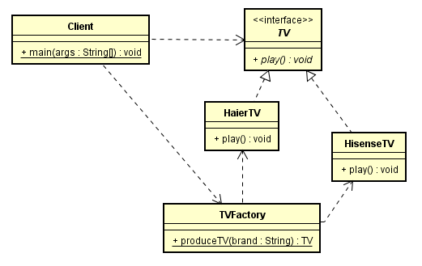

- homework2

  The following code is about how to decode an image based on the different formats.（实现这个系统的代码如下，请根据代码画出类图。）

  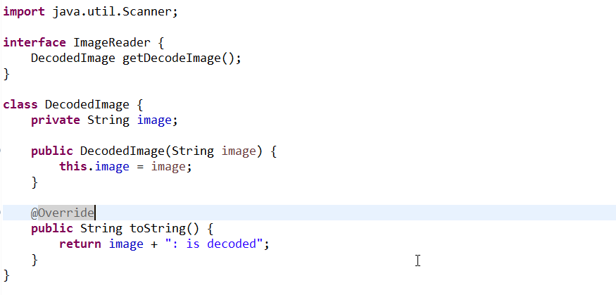

  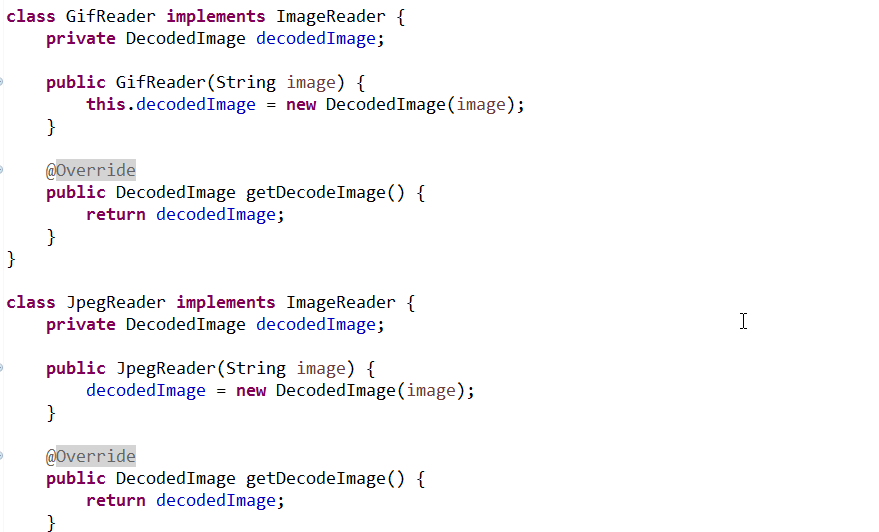

  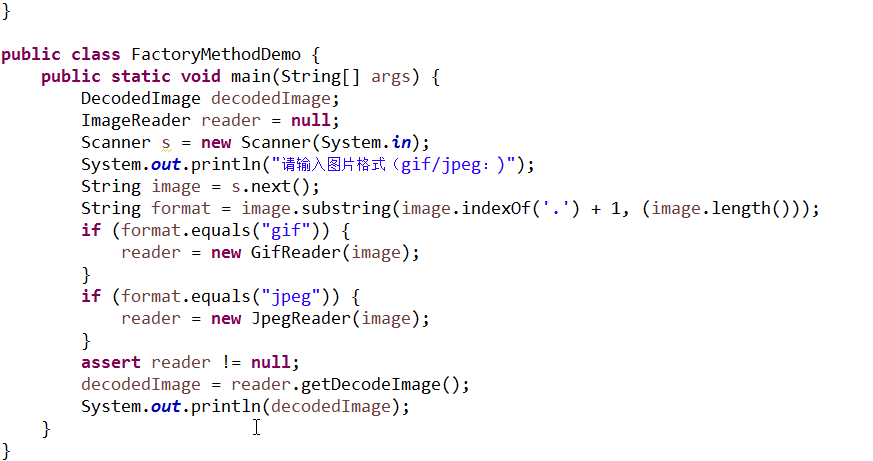

  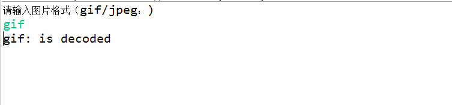

- homework3
  In a simulation game, you are supposed to create different pets based on the sound they make, e.g, if the sound an animal make is "quack",then you should create a duck.（模拟游戏中，请根据宠物的声音创建相应的宠物，如宠物发出“嘎嘎“声，应当创建宠物鸭子。请使用工厂模式来实现系统，绘制类图并编程实现。）
- report
  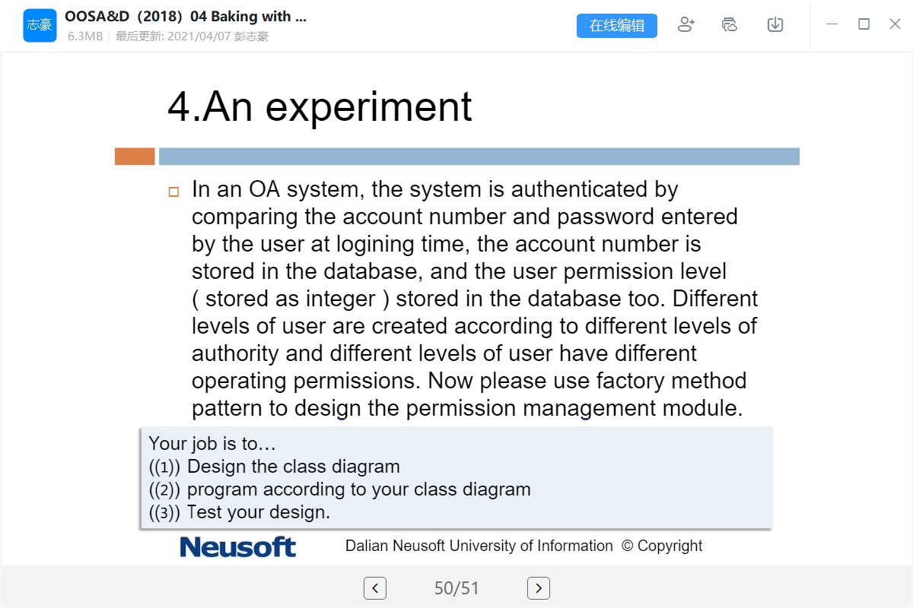